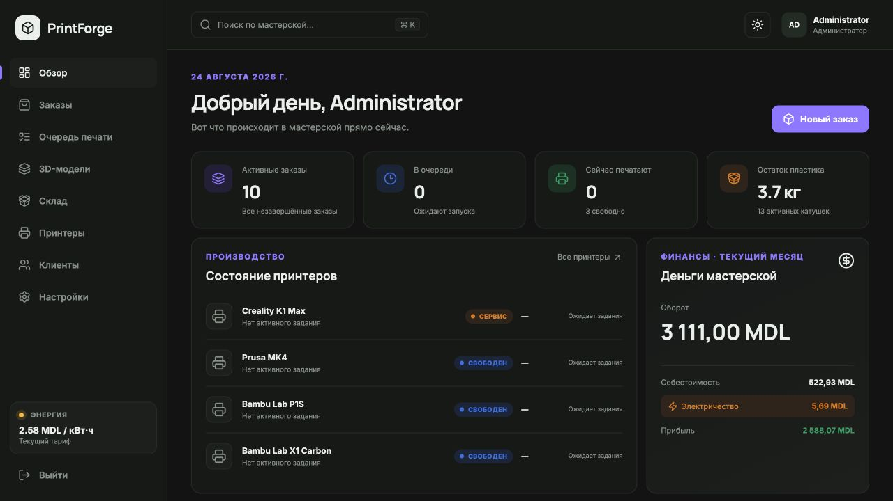
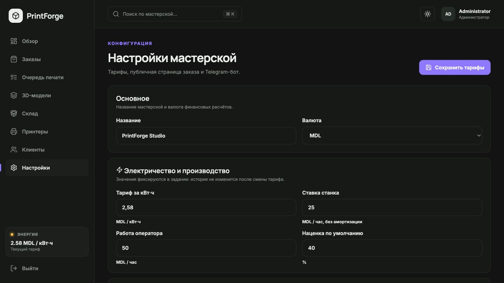
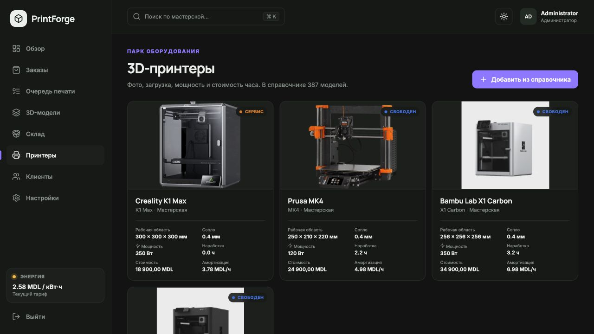
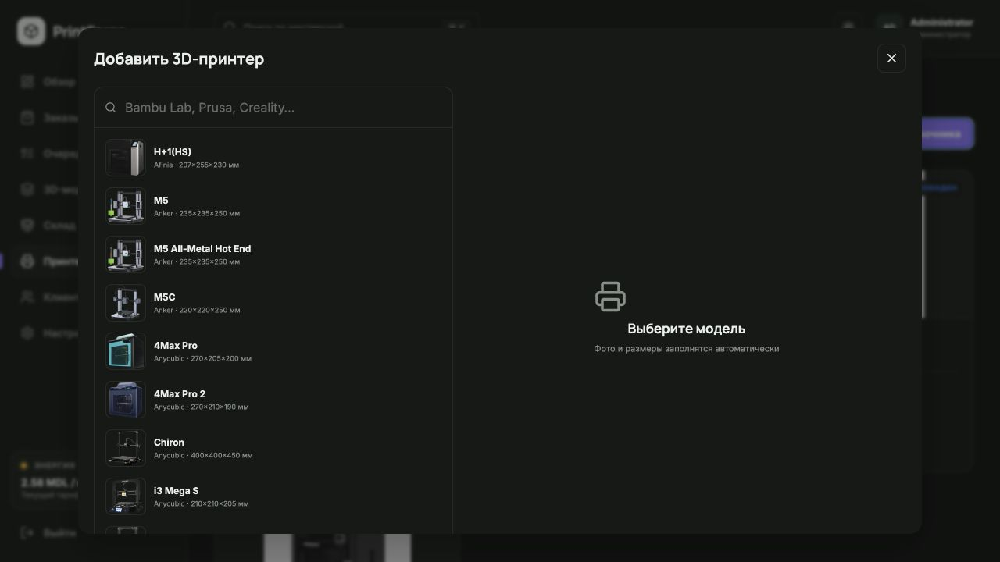
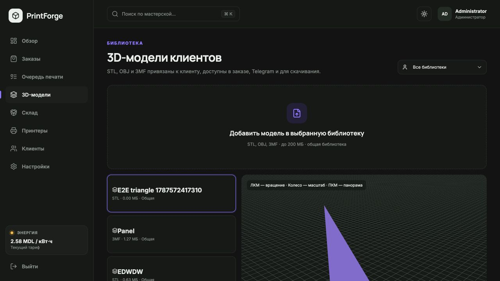
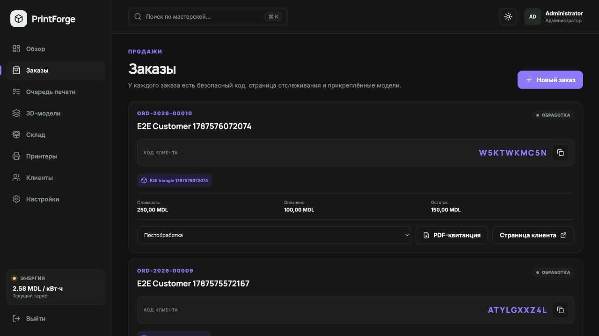
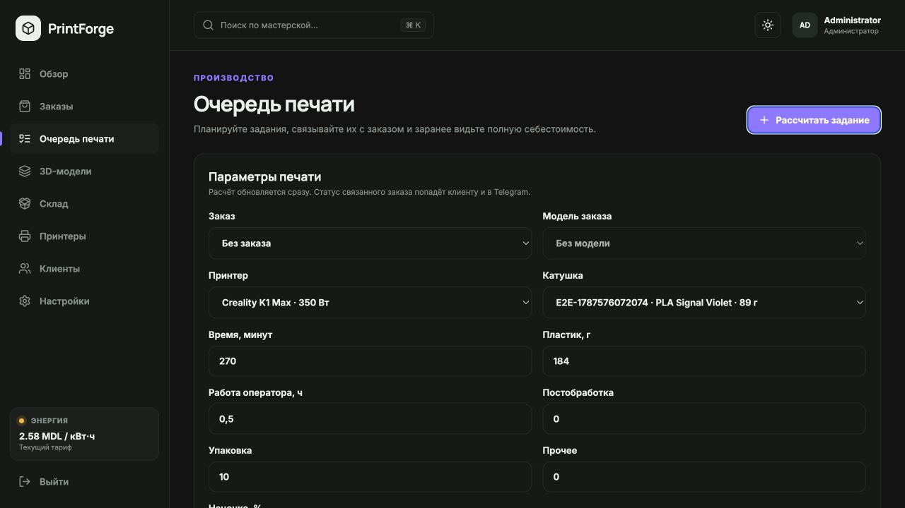
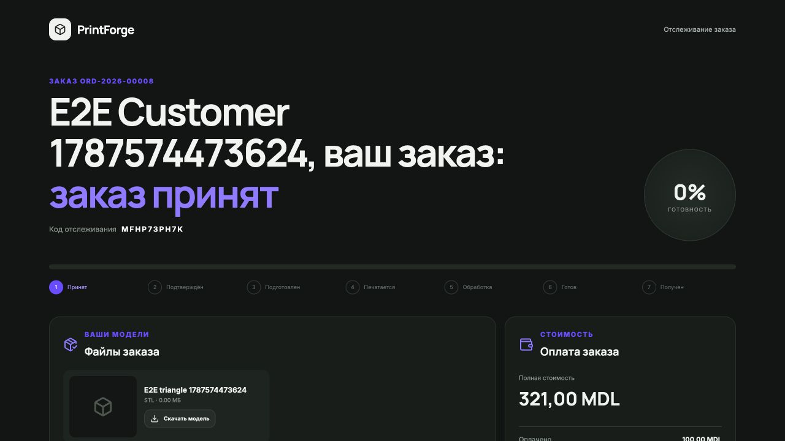
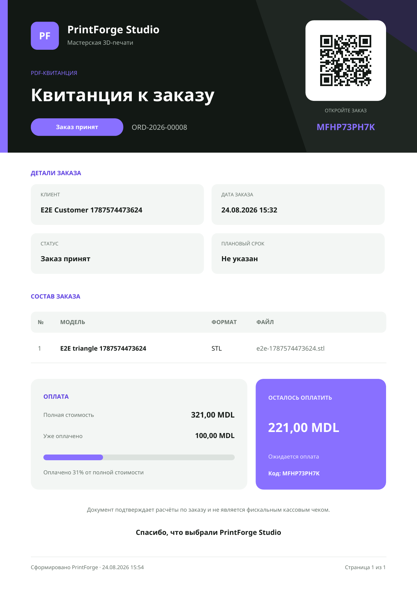

# Руководство пользователя PrintForge

[Русский](USER_GUIDE_RU.md) · [English](USER_GUIDE_EN.md)

Инструкция описывает обычный рабочий цикл владельца мастерской: от первого входа до выдачи клиенту PDF-квитанции и кода отслеживания.

## 1. Вход и обзор

Откройте `http://localhost` и войдите как администратор. На главном экране видны активные заказы, очередь, работающие принтеры, остаток пластика, оборот, себестоимость, электричество и прибыль.



Перед началом работы проверьте текущий тариф в левом нижнем углу. Он участвует в каждом новом расчёте печати.

## 2. Настройка мастерской

Перейдите в «Настройки»:

1. введите название, которое увидит клиент;
2. выберите валюту;
3. задайте тариф за кВт·ч;
4. укажите публичный URL для клиентских ссылок и QR-кода;
5. сохраните изменения.



Изменение тарифа применяется к новым заданиям. Уже созданные задания сохраняют прежнее значение для корректной истории.

## 3. Добавление принтера

Перейдите в «Принтеры» и нажмите «Добавить из справочника».



В каталоге доступно 387 профилей. Поиск работает по производителю и модели.



1. найдите принтер;
2. выберите карточку — фотография и рабочая область заполнятся автоматически;
3. введите среднюю мощность в ваттах;
4. укажите стоимость покупки и параметры амортизации;
5. сохраните.

Средняя мощность должна отражать реальную печать, а не только максимальное значение с блока питания. Для более точного результата измерьте потребление розеточным ваттметром.

## 4. Добавление катушки

Откройте «Склад» и создайте катушку: внутренний код, производитель, продукт, материал, цвет, начальный/оставшийся вес, закупочную цену и поставщика.

PrintForge рассчитывает цену грамма из закупочной цены и начального веса. После успешного завершения задания фактический вес автоматически списывается и появляется движение склада.

## 5. Создание клиента

Откройте «Клиенты», нажмите добавление и заполните имя, компанию, телефон и email. Один клиент может иметь много моделей и заказов.

## 6. Библиотека моделей клиента

Откройте «3D-модели» и загрузите STL, OBJ или 3MF.



1. выберите владельца модели;
2. задайте понятное название;
3. выберите исходный файл;
4. при необходимости добавьте фотографию;
5. сохраните.

Для 3MF система старается извлечь встроенное превью. Для STL и OBJ загрузите изображение вручную. Исходник остаётся доступен для скачивания администратору и через связанный заказ.

## 7. Создание заказа

Перейдите в «Заказы» и нажмите «Новый заказ».



1. выберите клиента;
2. прикрепите одну или несколько моделей из его библиотеки;
3. укажите количество, срок, заметку, цену и уже внесённую оплату;
4. создайте заказ.

Система выдаст внутренний номер вида `ORD-2026-00001`, случайный 10-значный код без неоднозначных `0/O` и `1/I`, а также публичную ссылку вида `/track/CODE`.

Передайте клиенту код, ссылку или PDF. Не используйте номер заказа вместо кода: публичное отслеживание принимает именно tracking code.

## 8. Расчёт печатного задания

Откройте «Очередь печати» и нажмите «Рассчитать задание».



Заполните:

1. заказ и модель;
2. принтер;
3. катушку;
4. время печати в минутах;
5. массу пластика;
6. время оператора;
7. постобработку, упаковку и прочие расходы;
8. наценку.

Расчёт обновляется сразу. Проверьте материал, электричество, станок, амортизацию и итоговую цену, затем добавьте задание в очередь.

## 9. Производство и факт

Меняйте статус задания по мере работы. При завершении укажите фактические минуты печати, граммы и кВт·ч, если есть показание ваттметра.

Если кВт·ч не заполнены, система вычислит их из мощности и времени. Статус `SUCCESS` в одной транзакции обновляет задание, списывает пластик, записывает движение склада, увеличивает наработку принтера и пересчитывает факт.

## 10. Что видит клиент

Клиент открывает ссылку или вводит код в Telegram. Публичная страница показывает текущую стадию, процент готовности, модели, стоимость, оплату и остаток.



Клиент может скачать разрешённые исходные файлы и PDF-квитанцию, но не получает доступ к административной панели или чужим заказам.

## 11. PDF-квитанция

В карточке заказа нажмите «Скачать PDF». На публичной странице клиенту доступна такая же кнопка.



В документ входят бренд мастерской, номер и код заказа, QR-ссылка, клиент, дата, срок, статус, модели, полная сумма, оплата и остаток.

Это подтверждение расчёта и состояния оплаты, а не фискальный чек кассового аппарата.

## 12. Telegram-бот

После подключения бота в настройках клиент:

1. открывает вашего бота;
2. отправляет tracking code;
3. получает статус, готовность и оплату;
4. может увидеть фотографию и получить файл модели.

Для каждого заказа используется свой код. Один и тот же клиент может проверять несколько заказов, отправляя разные коды.

## 13. Ежедневная практика администратора

В начале дня:

- проверьте очередь, свободные принтеры и катушки с малым остатком;
- убедитесь, что тариф электричества актуален;
- посмотрите незавершённые заказы и сроки.

После каждой печати:

- фиксируйте факт, особенно граммы и время;
- меняйте статус заказа;
- проверяйте остаток катушки;
- при необходимости отправляйте клиенту обновлённую квитанцию.

В конце дня просмотрите оборот, себестоимость и прибыль; создайте backup перед крупными изменениями или обновлением.

## 14. Если что-то не работает

```bash
docker compose ps
docker compose logs --tail=200
curl -fsS http://localhost/health
```

Подробная диагностика, настройка порта, восстановление и обновление описаны в [SETUP_RU.md](SETUP_RU.md).
